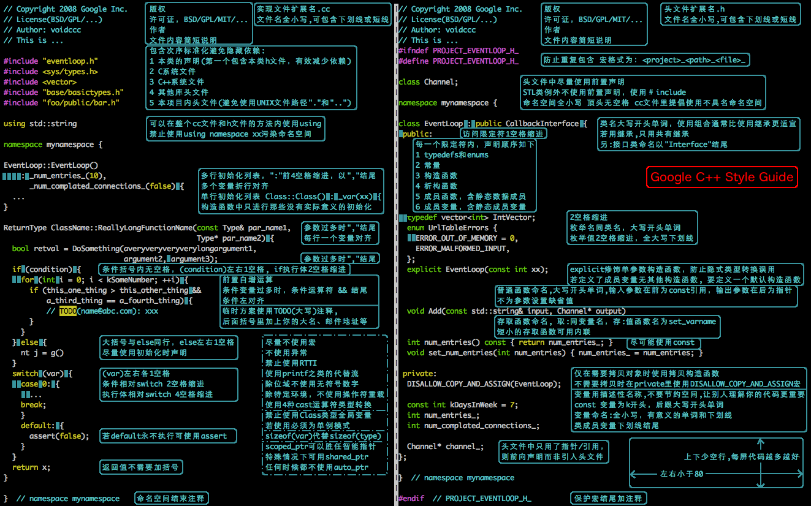

# Google style guide 主要内容

Google 开源项目风格指南原文：

- 中文版：<https://zh-google-styleguide.readthedocs.io/en/latest/>
- 英文版：<https://google.github.io/styleguide/cppguide.html>

github仓库为：<https://github.com/google/styleguide>

**目录：**

- [1. 头文件](#1-头文件)
  - [1.1. Self-contained 头文件](#11-self-contained-头文件)
  - [1.2. #define 保护](#12-define-保护)
  - [1.3. 前置声明](#13-前置声明)
  - [1.4. 内联函数](#14-内联函数)
  - [1.5. #include 的路径及顺序](#15-include-的路径及顺序)
- [2. 作用域](#2-作用域)
  - [2.1. 命名空间](#21-命名空间)
  - [2.2. 匿名命名空间和静态变量](#22-匿名命名空间和静态变量)
  - [2.3. 非成员函数、静态成员函数和全局函数](#23-非成员函数静态成员函数和全局函数)
  - [2.4. 局部变量](#24-局部变量)
  - [2.5. 静态和全局变量](#25-静态和全局变量)
- [3. 类](#3-类)
  - [3.1. 构造函数的职责](#31-构造函数的职责)
  - [3.2. 隐式类型转换](#32-隐式类型转换)
  - [3.3. 可拷贝类型和可移动类型](#33-可拷贝类型和可移动类型)
  - [3.4. 结构体 VS. 类](#34-结构体-vs-类)
  - [3.5. 继承](#35-继承)
  - [3.6. 多重继承](#36-多重继承)
  - [3.7. 接口](#37-接口)
  - [3.8. 运算符重载](#38-运算符重载)
  - [3.9. 存取控制](#39-存取控制)
  - [3.10. 声明顺序](#310-声明顺序)
  - [3.11. 其他](#311-其他)
- [4. 函数](#4-函数)
  - [4.1. 参数顺序](#41-参数顺序)
  - [4.2. 编写简短函数](#42-编写简短函数)
  - [4.3. 引用参数](#43-引用参数)
  - [4.4. 函数重载](#44-函数重载)
  - [4.5. 缺省参数](#45-缺省参数)
  - [4.6. 函数返回类型后置语法](#46-函数返回类型后置语法)
- [5. 来自 Google 的奇技](#5-来自-google-的奇技)
  - [5.1. 所有权与智能指针](#51-所有权与智能指针)
  - [5.2. Cpplint](#52-cpplint)
  - [5.3. 其他](#53-其他)
- [6. 其他C++ 特性](#6-其他c-特性)
  - [6.1. 右值引用](#61-右值引用)
  - [6.2. 变长数组和alloca()](#62-变长数组和alloca)
  - [6.3. 友元](#63-友元)
  - [6.4. 异常](#64-异常)
  - [6.5. 运行时类型识别](#65-运行时类型识别)
  - [6.6. 类型转换](#66-类型转换)
  - [6.7. 流](#67-流)
  - [6.8. 前置自增和自减](#68-前置自增和自减)
  - [6.9. const 用法](#69-const-用法)
  - [6.10. constexpr 用法](#610-constexpr-用法)
  - [6.11. 整型](#611-整型)
  - [6.12. 64 位下的可移植性](#612-64-位下的可移植性)
  - [6.13. 预处理宏](#613-预处理宏)
  - [6.14. 0, nullptr 和NULL](#614-0-nullptr-和null)
  - [6.15. sizeof](#615-sizeof)
  - [6.16. auto](#616-auto)
  - [6.17. 列表初始化](#617-列表初始化)
  - [6.18. Lambda 表达式](#618-lambda-表达式)
  - [6.19. 模板编程](#619-模板编程)
  - [6.20. Boost 库](#620-boost-库)
  - [6.21. C++11](#621-c11)
- [7. 命名约定](#7-命名约定)
  - [7.1. 通用命名规则](#71-通用命名规则)
  - [7.2. 文件命名](#72-文件命名)
  - [7.3. 类型命名](#73-类型命名)
  - [7.4. 变量命名](#74-变量命名)
  - [7.5. 常量命名](#75-常量命名)
  - [7.6. 函数命名](#76-函数命名)
  - [7.7. 命名空间命名](#77-命名空间命名)
  - [7.8. 枚举命名](#78-枚举命名)
  - [7.9. 宏命名](#79-宏命名)
  - [7.10. 命名规则的特例](#710-命名规则的特例)
- [8. 注释](#8-注释)
  - [8.1. 注释风格](#81-注释风格)
  - [8.2. 文件注释](#82-文件注释)
  - [8.3. 类注释](#83-类注释)
  - [8.4. 函数注释](#84-函数注释)
  - [8.5. 变量注释](#85-变量注释)
  - [8.6. 实现注释](#86-实现注释)
  - [8.7. 标点, 拼写和语法](#87-标点-拼写和语法)
  - [8.8. TODO 注释](#88-todo-注释)
  - [8.9. 弃用注释](#89-弃用注释)
  - [8.10. 其他](#810-其他)
- [9. 格式](#9-格式)
  - [9.1. 行长度](#91-行长度)
  - [9.2. 非ASCII 字符](#92-非ascii-字符)
  - [9.3. 空格还是制表位](#93-空格还是制表位)
  - [9.4. 函数声明与定义](#94-函数声明与定义)
  - [9.5. Lambda 表达式](#95-lambda-表达式)
  - [9.6. 函数调用](#96-函数调用)
  - [9.7. 列表初始化格式](#97-列表初始化格式)
  - [9.8. 条件语句](#98-条件语句)
  - [9.9. 循环和switch选择语句](#99-循环和switch选择语句)
  - [9.10. 指针和引用表达式](#910-指针和引用表达式)
  - [9.11. 布尔表达式](#911-布尔表达式)
  - [9.12. 函数返回值](#912-函数返回值)
  - [9.13. 变量及数组初始化](#913-变量及数组初始化)
  - [9.14. 预处理指令](#914-预处理指令)
  - [9.15. 类格式](#915-类格式)
  - [9.16. 构造函数初始值列表](#916-构造函数初始值列表)
  - [9.17. 命名空间格式化](#917-命名空间格式化)
  - [9.18. 水平留白](#918-水平留白)
  - [9.19. 垂直留白](#919-垂直留白)
  - [9.20. 其他](#920-其他)
- [10. 规则特例](#10-规则特例)
  - [10.1. 现有不合规范的代码](#101-现有不合规范的代码)
  - [10.2. Windows 代码](#102-windows-代码)
- [11. 项目目录结构(自添加)](#11-项目目录结构自添加)
  - [11.1. 基本原则](#111-基本原则)
- [12. 结束语](#12-结束语)

## 1. 头文件

**通常每一个 .cc 文件都有一个对应的 .h 文件**，也有一些常见例外, 如单元测试代码和只包含main() 函数的 .cc 文件.

### 1.1. Self-contained 头文件

头文件应该能够**自给自足**（self-contained, 也就是可以作为第一个头文件被引入），以.h 结尾。至于用来插入文本的文件，说到底它们并不是头文件，所以应以.inc 结尾。不允许分离出-inl.h 头文件的做法.

> **self-contained**: 用户和重构工具不需要为特别场合而包含额外的头文件。详言之，一个头文件要有 [1.2 #define](#12-define-保护) 保护，统统包含它所需要的其它头文件，也不要求定义任何特别symbols.
>
> 不过有一个例外，即一个文件并不是self-contained 的，而是作为文本插入到代码某处。或者，文件内容实际上是其它头文件的特定平台（platform-specific）扩展部分。**这些文件就要用 .inc 文件扩展名**。

### 1.2. #define 保护

**所有头文件都应该使用 #define 来防止头文件被多重包含**, 命名格式当是: \<PROJECT\>\_\<PATH\>\_\<FILE\>\_H\_

为保证唯一性, 头文件的命名应该**基于所在项目源代码树的全路径**. 例如, 项目foo 中的头文件foo/src/bar/baz.h 可按如下方式保护:

```cpp
#ifndef FOO_BAR_BAZ_H_
#define FOO_BAR_BAZ_H_
...
#endif // FOO_BAR_BAZ_H_
```

注意：最后的#endif语句需要有注释

### 1.3. 前置声明

尽可能地避免使用前置声明。使用 #include 包含需要的头文件即可。

> 前置声明：（forward declaration）是类、函数和模板的纯粹声明，没伴随着其定义.
>
> 前置声明是为了降低编译依赖，防止修改一个头文件引发多米诺效应;

### 1.4. 内联函数

只有当函数只有10 行甚至更少时才将其定义为内联函数.

> 当函数被声明为内联函数之后, 编译器会将其内联展开, 而不是按通常的函数调用机制进行调用.
>
> 只要内联的函数体较小, 内联该函数可以令目标代码更加高效. **对于存取函数以及其它函数体比较短**, **性能关键的函数, 鼓励使用内联**.

### 1.5. #include 的路径及顺序

使用标准的头文件包含顺序可增强可读性: 相关头文件, C 库, C++ 库, 其他库的.h, 本项目内的.h，避免隐藏依赖。

> 例子：
> dir/foo.cc 或dir/foo_test.cc 的主要作用是实现或测试dir2/foo2.h 的功能, foo.cc中包含头文件的次序如下:
>
> 1. dir2/foo2.h (优先位置, 详情如下)
> 2. C 系统文件
> 3. C++ 系统文件
> 4. 其他库的.h 文件
> 5. 本项目内.h 文件
>
> 这种优先的顺序排序**保证当dir2/foo2.h 遗漏某些必要的库**时，dir/foo.cc 或dir/foo_test.cc 的构建会立刻中止。因此这一条规则保证维护这些文件的人们首先看到构建中止的消息而不是维护其他包的人们。

不过，凡是cc 文件所对应的「相关头文件」已经包含的，就不用再重复包含进其cc 文件里面了，就像foo.cc只包含foo.h就够了，不用再管后者所包含的其它内容。

## 2. 作用域

### 2.1. 命名空间

鼓励在.cc文件内使用匿名命名空间或static 声明. 使用具名的命名空间时, 其**名称可基于项目名或相对路径**. 禁止使用using 指示（using-directive）（个人待定）。禁止使用内联命名空间（inline namespace）。

1. 遵循后续章节所说的[命名约定](#命名约定)
2. 在命名空间的最后注释出命名空间的名字。
3. 用命名空间把文件包含、[gflags](https://gflags.github.io/gflags/)的声明/定义、以及类的前置声明**以外**的整个源文件封装起来, 以区别于其它命名空间:

```cpp
// .h 文件
namespace mynamespace {

// 所有声明都置于命名空间中
// 注意不要使用缩进
class MyClass {
public:
...
void Foo();
};

} // namespace mynamespace
```

```cpp
// .cc 文件
namespace mynamespace {

// 函数定义都置于命名空间中
void MyClass::Foo() {
...
}

} // namespace mynamespace
```

4. 不要在命名空间std 内声明任何东西, 包括标准库的类前置声明. 在std 命名空间声明实体是未定义的行为, 会导致如不可移植. (声明标准库下的实体, 需要包含对应的头文件).
5. 不应该使用using 指示引入整个命名空间的标识符号。

   ```cpp
    // 禁止—— 污染命名空间
    using namespace foo;
   ```

6. 不要在头文件中使用命名空间别名除非显式标记内部命名空间使用。因为任何在头文件中引入的命名空间都会成为公开API 的一部分。

```cpp
// 在.cc 中使用别名缩短常用的命名空间
namespace baz = ::foo::bar::baz;
```

```cpp
// 在.h 中使用别名缩短常用的命名空间
namespace librarian {

namespace impl { // 仅限内部使用
namespace sidetable = ::pipeline_diagnostics::sidetable;
} // namespace impl

inline void my_inline_function() {
// 限制在一个函数中的命名空间别名
namespace baz = ::foo::bar::baz;
...
}

} // namespace librarian
```

7. 禁止用内联命名空间(参考：<https://blog.csdn.net/craftsman1970/article/details/82872497>)

> 嵌套类符合局部使用原则, 只是不能在其他头文件中前置声明, 尽量不要public;

### 2.2. 匿名命名空间和静态变量

在.cc文件中定义一个不需要被外部引用的变量时，可以将它们放在匿名命名空间或声明为static 。但是不要在.h 文件中这么做。

匿名命名空间的声明和具名的格式相同，在最后注释上namespace :

```cpp
namespace {
...
} // namespace
```

### 2.3. 非成员函数、静态成员函数和全局函数

- 推荐使用**静态成员函数**或**命名空间内的非成员函数**, 尽量**不**要用裸的全局函数.
- 为了封装多个非成员函数，应将一系列函数直接置于命名空间中，不要用类的静态方法模拟出命名空间的效果。将非成员函数放在命名空间内可避免污染全局作用域. 非成员函数不应依赖于外部变量
- 类的静态方法应当和**类的实例**或**静态数据**紧密相关.

> 定义在同一编译单元的函数, 被其他编译单元直接调用可能会引入不必要的耦合和链接时依赖; 静态成员函数对此尤其敏感. 可以考虑提取到新类中, 或者将函数置于独立库的命名空间
> 如果你必须定义非成员函数, 又只是在.cc 文件中使用它, 可使用匿名2.1. 命名空间或static 链接关键字(如static int Foo() {...}) 限定其作用域.

### 2.4. 局部变量

将函数变量尽可能置于最小作用域内, 并**在变量声明时进行初始化**.

特别是，应使用初始化的方式替代声明再赋值, 比如

```cpp
int i;
i = f(); // 坏——初始化和声明分离
```

```cpp
int j = g(); // 好——初始化时声明
```

```cpp
vector<int> v;
v.push_back(1); // 用花括号初始化更好
v.push_back(2);
```

```cpp
vector<int> v = {1, 2}; // 好——v 一开始就初始化
```

属于if, while 和for 语句的变量应当在这些语句中正常地声明，这样子这些变量的作用域就被限制在这些语句中了，举例而言:

```cpp
while (const char* p = strchr(str, '/')) str = p + 1;
```

Warning: 有一个例外, 如果变量是一个对象, 每次进入作用域都要调用其构造函数, 每次退出作用域都要调用其析构函数. 这会导致效率降低.

### 2.5. 静态和全局变量

1. 禁止定义静态储存周期的非POD变量。
2. 禁止使用含有副作用的函数初始化POD全局变量

因为多编译单元中的静态变量执行时的构造和析构顺序是未明确的，这将导致代码的不可移植。

静态生存周期的对象（即包括了全局变量，静态变量，静态类成员变量和函数静态变量），都应该是是原生数据类型(POD : Plain Old Data): 即int, char 和float, 以及POD 类型的指针、数组和结构体。

> [静态储存周期](http://zh.cppreference.com/w/cpp/language/storage_duration#.E5.AD.98.E5.82.A8.E6.9C.9F):由于构造和析构函数调用顺序的不确定性，它们会导致难以发现的bug
> 静态变量的构造函数、析构函数和初始化的顺序在C++ 中是只有部分明确的，甚至随着构建变化而变化，导致难以发现的bug. 所以除了**禁用类类型的全局变量**，**我们也不允许用函数返回值来初始化POD变量**，除非该函数（比如getenv() 或getpid() ）不涉及任何全局变量。**函数作用域里的静态变量除外**，毕竟它的初始化顺序是有明确定义的，而且只会在指令执行到它的声明那里才会发生。

> 同一个编译单元内是明确的，静态初始化优先于动态初始化，初始化顺序按照声明顺序进行，销毁则逆序。不同的编译单元之间初始化和销毁顺序属于未明确行为(unspecified behaviour)。
> 如果您确实需要一个class 类型的静态或全局变量，可以考虑在main() 函数或pthread_once() 内初始化一个指针且永不回收。注意只能用raw 指针，别用智能指针，毕竟后者的析构函数涉及到上文指出的不定顺序问题。

PS：这里有点难懂，记住结论就好

## 3. 类

### 3.1. 构造函数的职责

不要在构造函数中调用虚函数，也不要在无法报出错误时进行可能失败的初始化，构造函数很难上报错误

> 如果执行失败, 会得到一个初始化失败的对象, 这个对象有可能进入不正常的状态, 必须使用bool IsValid() 或类似这样的机制才能检查出来, 然而这是一个十分容易被疏忽的方法.
>
> 构造函数的地址是无法被取得的

构造函数不得调用虚函数, 或尝试报告一个非致命错误. 如果对象需要进行有意义的(non-trivial) 初始化, 考虑使用明确的Init() 方法或使用工厂模式.

### 3.2. 隐式类型转换

不要定义隐式类型转换. 对于**转换运算符**和**单参数构造函数**, 请使用explicit 关键字.

类型转换运算符参考：<https://blog.csdn.net/small_prince_/article/details/80518982>

> 除了语言所定义的隐式类型转换, 用户还可以通过在类定义中添加合适的成员定义自己需要的转换.:
>
> 1. 在源类型中定义隐式类型转换, 可以通过目的类型名的类型转换运算符实现(例如operator bool()).
> 2. 在目的类型中定义隐式类型转换, 则通过以源类型作为其唯一参数(或唯一无默认值的参数) 的构造函数实现.

explicit 关键字可以用于构造函数或(在C++11 引入) 类型转换运算符, 以保证只有当目的类型在调用点被显式写明时才能进行类型转换, 例如使用cast. 这不仅作用于隐式类型转换, 还能作用于C++11 的列表初始化语法:

拷贝和移动构造函数不应当被标记为explicit, 因为它们并不执行类型转换.

### 3.3. 可拷贝类型和可移动类型

如果你的类型需要, 就让它们支持拷贝/ 移动. 否则, 就把隐式产生的拷贝和移动函数禁用.

> 可拷贝类型允许对象在初始化时得到来自相同类型的另一对象的值, 或在赋值时被赋予相同类型的另一对象的值, **同时不改变源对象的值**. 对于用户定义的类型, 拷贝操作一般通过拷贝构造函数与拷贝赋值操作符定义. string 类型就是一个可拷贝类型的例子.
>
> 可移动类型允许对象在初始化时得到来自相同类型的临时对象的值, 或在赋值时被赋予相同类型的临时对象的值(因此所有可拷贝对象也是可移动的). std::unique_ptr<int> 就是一个可移动但不可复制的对象的例子. 对于用户定义的类型, 移动操作一般是通过移动构造函数和移动赋值操作符实现的.
>
> 拷贝/ 移动构造函数在某些情况下会被编译器隐式调用. 例如, 通过传值的方式传递对象.
>
> 进一步可参考: [拷贝构造函数和移动构造函数](https://www.cnblogs.com/hunter-w/p/13884186.html)

如果你的类不需要拷贝/ 移动操作, 请显式地通过在public 域中使用= delete 或其他手段禁用之.

```cpp
// MyClass is neither copyable nor movable.
// 应该是禁用拷贝构造函数和拷贝赋值函数
MyClass(const MyClass&) = delete;
MyClass& operator=(const MyClass&) = delete;
```

### 3.4. 结构体 VS. 类

仅当只有数据成员时使用struct, 其它一概使用class.

> 在C++ 中struct 和class 关键字几乎含义一样. 我们为这两个关键字添加我们自己的语义理解, 以便为定义的数据类型选择合适的关键字.
>
> struct 用来定义包含数据的被动式对象, 也可以包含相关的常量, 但除了存取数据成员之外, 没有别的函数功能. 并且**存取功能是通过直接访问位域, 而非函数调用. 除了构造函数, 析构函数, Initialize(),Reset(), Validate() 等类似的用于设定数据成员的函数外, 不能提供其它功能的函数**.
>
> 如果需要更多的函数功能, class 更适合. 如果拿不准, 就用class.
>
> 为了和STL 保持一致, 对于仿函数等特性可以不用class 而是使用struct.
>
> 注意: 类和结构体的成员变量使用不同的命名规则.

### 3.5. 继承

使用组合常常比使用继承更合理. 如果使用继承的话, 定义为public 继承.

> 所有继承必须是public 的. 如果你想使用私有继承, 你应该替换成把基类的实例作为成员对象的方式.

必要的话, 析构函数声明为virtual. 如果你的类有虚函数, 则析构函数也应该为虚函数.

> 为什么基类的析构函数是虚函数? 在实现多态时，当用基类操作派生类，在析构时防止只析构基类而不析构派生类的状况发生。(如果不需要基类对派生类及对象进行操作,则不能定义虚函数,因为这样会增加内存开销.当类里面有定义虚函数的时候,编译器会给类添加一个虚函数表,里面来存放虚函数指针,这样就会增加类的存储空间.所以,只有当一个类被用来作为基类的时候,才把析构函数写成虚函数.)参考：<https://www.cnblogs.com/lixiaohui-ambition/archive/2012/07/13/2589716.html>

必要的话, 析构函数声明为virtual. 如果你的类有虚函数, 则析构函数也应该为虚函数.

对于可能被子类访问的成员函数, 不要过度使用protected 关键字. 注意, 数据成员都必须是私有的

在声明重载时, 请使用override, final 或virtual 的其中之一进行标记. 标记为override 或final 的析构函数如果不是对基类虚函数的重载的话, 编译会报错, 这有助于捕获常见的错误. 这些标记起到了文档的作用, 因为如果省略这些关键字, 代码阅读者不得不检查所有父类, 以判断该函数是否是虚函数.

### 3.6. 多重继承

真正需要用到多重实现继承的情况少之又少. 只在以下情况我们才允许多重继承: 最多只有一个基类是非抽象类; 其它基类都是以Interface 为后缀的纯接口类.

### 3.7. 接口

接口是指满足特定条件的类, 这些类**以Interface 为后缀**(不强制).

### 3.8. 运算符重载

除少数特定环境外, 不要重载运算符. 也不要创建用户定义字面量.

> C++ 允许用户通过使用operator 关键字对内建运算符进行重载定义, 只要其中一个参数是用户定义的类型. operator 关键字还允许用户使用operator"" 定义新的字面运算符, 并且定义类型转换函数, 例如operator bool().

### 3.9. 存取控制

将所有数据成员声明为private, 除非是static const 类型成员(遵循常量命名规则). 出于技术上的原因, 在使用[Google Test](https://github.com/google/googletest)时我们允许测试固件类中的数据成员为protected.

### 3.10. 声明顺序

将相似的声明放在一起, 将public 部分放在最前.

类定义一般应以public: 开始, 后跟protected:, 最后是private:. 省略空部分.

在各个部分中, 建议将类似的声明放在一起, 并且建议以如下的顺序: 类型(包括typedef, using 和嵌套
的结构体与类), 常量, 工厂函数, 构造函数, 赋值运算符, 析构函数, 其它函数, 数据成员(友元声明放最后).

不要将大段的函数定义内联在类定义中. 通常，只有那些普通的, 或性能关键且短小的函数可以内联在类
定义中. 参见内联函数一节.

> 工厂函数: 顾名思义，就好比一个工厂一样，可以批量制造某种类型的东西。其实说白了就是封装了个方法减少重复工作.这样写主要是为了解决需要创建大量有属性重叠的对象，如果每个都new一下，然后逐一添加属性。这也是个累人的活.

### 3.11. 其他

1. 不在构造函数中做太多逻辑相关的初始化;
2. 为避免拷贝构造函数, 赋值操作的滥用和编译器自动生成, 可将其声明为private 且无需实现;
3. 接口类类名以Interface 为后缀, 除提供带实现的虚析构函数, 静态成员函数外, 其他均为纯虚函数, 不定义非静态数据成员, 不提供构造函数, 提供的话, 声明为protected;
4. 存取函数一般内联在头文件中;

## 4. 函数

### 4.1. 参数顺序

函数的参数顺序为: 输入参数在先, 后跟输出参数.

特别要注意, 在加入新参数时不要因为它们是新参数就置于参数列表最后, 而是仍然要按照前述的规则, 即将新的输入参数也置于输出参数之前.

> 这并非一个硬性规定. 输入/输出参数(通常是类或结构体) 让这个问题变得复杂. 并且, 有时候为了其他函数保持一致, 你可能不得不有所变通.

### 4.2. 编写简短函数

我们倾向于编写简短、凝练的函数.

> 我们承认长函数有时是合理的, 因此并不硬性限制函数的长度. 如果函数超过40 行, 可以思索一下能不能在不影响程序结构的前提下对其进行分割.
>
> 即使一个长函数现在工作的非常好, 一旦有人对其修改, 有可能出现新的问题, 甚至导致难以发现的bug.使函数尽量简短, 以便于他人阅读和修改代码.

### 4.3. 引用参数

所有按引用传递的参数必须加上const.

> 定义引用参数可以防止出现(*pval)++ 这样丑陋的代码

有时候, 在输入形参中用const T* 指针比const T& 更明智. 比如:

- 可能会传递空指针.
- 函数要把指针或对地址的引用赋值给输入形参.

总而言之, 大多时候输入形参往往是const T&. 若用const T* 则说明输入另有处理. 所以若要使用
const T*, 则应给出相应的理由, 否则会使得读者感到迷惑.

### 4.4. 函数重载

若要使用函数重载, 则必须能让读者一看调用点就胸有成竹, 而不用花心思猜测调用的重载函数到底是哪一种. 这一规则也适用于构造函数.

> 如果打算重载一个函数, 可以试试改在函数名里加上参数信息. 例如, 用AppendString() 和AppendInt() 等, 而不是一口气重载多个Append(). 如果重载函数的目的是为了支持不同数量的同一类型参数, 则优先考虑使用std::vector 以便使用者可以用列表初始化指定参数.

### 4.5. 缺省参数

只允许在非虚函数中使用缺省参数, 且必须保证缺省参数的值始终一致. 缺省参数与函数重载遵循同样的规则. 一般情况下建议使用函数重载,

> - 虚函数调用的缺省参数取决于目标对象的静态类型, 此时无法保证给定函数的所有重载声明的都是同样的缺省参数.
> - 缺省参数会干扰函数指针, 导致函数签名与调用点的签名不一致. 而函数重载不会导致这样的问题.
> - 如果在每个调用点缺省参数的值都有可能不同, 在这种情况下缺省函数也不允许使用. (例如, 不要写像void f(int n = counter++); 这样的代码.)

此外把自带缺省参数的函数地址赋值给指针时，会丢失缺省参数信息。

我还发现滥用缺省参数会害得读者光只看调用代码的话，会误以为其函数接受的参数数量比实际上还要少。


### 4.6. 函数返回类型后置语法

只有在常规写法(返回类型前置) 不便于书写或不便于阅读时使用返回类型后置语法.

C++ 现在允许两种不同的函数声明方式. 以往的写法是将返回类型置于函数名之前. 例如:

```cpp
int foo(int x);
```

C++11 引入了这一新的形式. 现在可以在函数名前使用auto 关键字, 在参数列表之后后置返回类型. 例如:

```cpp
auto foo(int x) -> int;
```

> 后置返回类型是显式地指定Lambda 表达式的返回值的唯一方式. 某些情况下, 编译器可以自动推导出Lambda 表达式的返回类型, 但并不是在所有的情况下都能实现. 即使编译器能够自动推导, 显式地指定返回类型也能让读者更明了.

[Should the trailing return type syntax style become the default for new C++11 programs?](https://stackoverflow.com/questions/11215227/should-the-trailing-return-type-syntax-style-become-the-default-for-new-c11-pr) 讨论了auto 与尾置返回类型一起用的全新编码风格，值得一看。

## 5. 来自 Google 的奇技

Google 用了很多自己实现的技巧/ 工具使C++ 代码更加健壮, 我们使用C++ 的方式可能和你在其它地方见到的有所不同.

### 5.1. 所有权与智能指针

动态分配出的对象最好有单一且固定的所有主, 并通过智能指针传递所有权.

> 智能指针是一个通过重载* 和-> 运算符以表现得如指针一样的类. 智能指针类型被用来自动化所有权的登记工作, 来确保执行销毁义务到位. std::unique_ptr 是C++11 新推出的一种智能指针类型, 用来表示动态分配出的对象的独一无二的所有权; 当std::unique_ptr 离开作用域时, 对象就会被销毁.std::unique_ptr 不能被复制, 但可以把它移动（move）给新所有主. std::shared_ptr 同样表示动态分配对象的所有权, 但可以被共享, 也可以被复制; 对象的所有权由所有复制者共同拥有, 最后一个复制者被销毁时, 对象也会随着被销毁.

> 所有权共享机制的登记工作在运行时进行, 开销可能相当大. **这个用法需要权衡。智能指针并不能够完全代替原生指针.**

### 5.2. Cpplint

使用 [cpplint.py](https://github.com/google/styleguide/blob/gh-pages/cpplint/cpplint.py) 检查风格错误.

> cpplint.py 是一个用来分析源文件, 能检查出多种风格错误的工具. 它并不完美, 甚至还会漏报和误报,但它仍然是一个非常有用的工具. 在行尾加// NOLINT, 或在上一行加// NOLINTNEXTLINE, 可以忽略报错.

### 5.3. 其他

1. 把智能指针当成对象来看待的话, 就很好领会它与所指对象之间的关系了.
2. 原来Rust 的Ownership 思想是受到了C++ 智能指针的很大启发啊.

## 6. 其他C++ 特性

### 6.1. 右值引用

只在定义移动构造函数与移动赋值操作时使用右值引用. 不要使用std::forward，你可能会使用std::move 来表示将值从一个对象移动而不是复制到另一个对象.

> 用于定义移动构造函数(使用类的右值引用进行构造的函数) 使得移动一个值而非拷贝之成为可能. 例如, 如果v1 是一个vector<string>, 则auto v2(std::move(v1)) 将很可能不再进行大量的数据复制而只是简单地进行指针操作, 在某些情况下这将带来大幅度的性能提升.

### 6.2. 变长数组和alloca()

我们不允许使用变长数组和alloca().

变长数组和alloca() 不是标准C++ 的组成部分. 更重要的是, 它们根据数据大小动态分配堆栈内存, 会引起难以发现的内存越界bugs: “在我的机器上运行的好好的, 发布后却莫名其妙的挂掉了”.

### 6.3. 友元

**我们允许合理的使用友元类及友元函数.**

**通常友元应该定义在同一文件内**, 避免代码读者跑到其它文件查找使用该私有成员的类. 经常用到友元的一个地方是将FooBuilder 声明为 Foo 的友元, 以便FooBuilder 正确构造Foo 的内部状态, 而无需将该状态暴露出来. 某些情况下, 将一个单元测试类声明成待测类的友元会很方便.

友元扩大了(但没有打破) 类的封装边界. 某些情况下, 相对于将类成员声明为public, 使用友元是更好的选择, 尤其是如果你只允许另一个类访问该类的私有成员时. 当然, 大多数类都只应该通过其提供的公有成员进行互操作.

### 6.4. 异常

**我们不使用C++ 异常.**

> 异常是处理构造函数失败的唯一途径。虽然可以用工厂函数（acgtyrant 注：factory function, 出自 C++ 的一种设计模式，即「简单工厂模式」）或Init() 方法代替异常, 但是前者要求在堆栈分配内存，后者会导致刚创建的实例处于”无效“状态。

> 很多C++ 书籍上都提到当构造失败时只有异常可以处理, Google 禁止使用异常这一点, 仅仅是为了自身的方便, 说大了, 无非是基于软件管理成本上, 实际使用中还是自己决定

[对使用C++ 异常处理应具有怎样的态度？](https://www.zhihu.com/question/22889420) 非常值得一读。

### 6.5. 运行时类型识别

**我们禁止使用RTTI.**

> RTTI 允许程序员在运行时识别C++ 类对象的类型. 它通过使用typeid 或者dynamic_cast完成.
>
> 在运行时判断类型通常意味着设计问题. 如果你需要在运行期间确定一个对象的类型, 这通常说明你需要考虑重新设计你的类.
> 在单元测试中可以使用RTTI, 但是在其他代码中请尽量避免. 尤其是在新代码中, 使用RTTI 前务必三思.

### 6.6. 类型转换

使用C++ 的类型转换, 如static_cast<>(). 不要使用int y = (int)x 或int y = int(x) 等转换方式;

C++ 采用了有别于C 的类型转换机制, 对转换操作进行归类.

C 语言的类型转换问题在于模棱两可的操作; 有时是在做强制转换(如(int)3.5), 有时是在做类型转换(如(int)"hello"). 另外, C++ 的类型转换在查找时更醒目.

不要使用C 风格类型转换. 而应该使用C++ 风格.

- 用static_cast 替代C 风格的值转换, 或某个类指针需要明确的向上转换为父类指针时.
- 用const_cast 去掉const 限定符.
- 用reinterpret_cast 指针类型和整型或其它指针之间进行不安全的相互转换. 仅在你对所做一切了然于心时使用.
- 至于dynamic_cast 参见运行时类型识别.

### 6.7. 流

**只在记录日志时使用流.**

> 流用来替代printf() 和scanf().

### 6.8. 前置自增和自减

对于迭代器和其他模板对象使用前缀形式(++i) 的自增、自减运算符.

> 不考虑返回值的话, 前置自增(++i) 通常要比后置自增(i++) 效率更高. 因为后置自增(或自减) 需要对表达式的值i 进行一次拷贝. 如果i 是迭代器或其他非数值类型, 拷贝的代价是比较大的. 既然两种自增方式实现的功能一样, 为什么不总是使用前置自增呢?
>
> 对简单数值(非对象), 两种都无所谓. 对迭代器和模板类型, 使用前置自增(自减).

### 6.9. const 用法

我们强烈建议你在任何可能的情况下都要使用const. 此外有时改用C++11 推出的constexpr更好。

> 在声明的变量或参数前加上关键字const 用于指明变量值不可被篡改(如const int foo). 为类中的函数加上const 限定符表明该函数不会修改类成员变量的状态(如class Foo {int Bar(char c) const; };).
>
> 关键字mutable 可以使用, 但是在多线程中是不安全的, 使用时首先要考虑线程安全.
>
> 有人喜欢int const \*foo 形式, 不喜欢const int\* foo, 他们认为前者更一致因此可读性也更好: 遵循了const 总位于其描述的对象之后的原则. 但是一致性原则不适用于此, “不要过度使用”的声明可以取消大部分你原本想保持的一致性. 将const 放在前面才更易读, 因为在自然语言中形容词(const) 是在名词(int) 之前.
>
> 这是说, 我们提倡但不强制const 在前. 但要保持代码的一致性!

### 6.10. constexpr 用法

在C++11 里，用constexpr 来定义真正的常量，或实现常量初始化。

> 变量可以被声明成constexpr 以表示它是真正意义上的常量，即在编译时和运行时都不变。函数或构造函数也可以被声明成constexpr, 以用来定义constexpr 变量。

### 6.11. 整型

**C++ 内建整型中, 仅使用int.** 如果程序中需要不同大小的变量, 可以使用<stdint.h> 中长度精确的整型, 如int16_t. 如果您的变量可能不小于2^31 (2GiB), 就用64 位变量比如int64_t. 此外要留意，哪怕您的值并不会超出int 所能够表示的范围，在计算过程中也可能会溢出。所以拿不准时，干脆用更大的类型。

> C++ 没有指定整型的大小. 通常人们假定short 是16 位, int 是32 位, long 是32 位, long long 是64 位. C++ 中整型大小因编译器和体系结构的不同而不同.

**推荐使用标准类型如size_t 和ptrdiff_t.**

不要使用uint32_t等无符号整型, 除非你是在表示一个位组而不是一个数值, 或是你需要定义二进制补码溢出. **尤其是不要为了指出数值永不会为负, 而使用无符号类型.** 相反, 你应该使用断言来保护数据.

有些人, 包括一些教科书作者, 推荐使用无符号类型表示非负数. 这种做法试图达到自我文档化. 但是, 在C 语言中, 这一优点被由其导致的bug 所淹没. 看看下面的例子:

```cpp
for (unsigned int i = foo.Length()-1; i >= 0; --i) ...
```

上述循环永远不会退出! 有时gcc 会发现该bug 并报警, 但大部分情况下都不会. **类似的bug还会出现在比较有符号变量和无符号变量时. 主要是C 的类型提升机制会致使无符号类型的行为出乎你的意料.**
关于类型提升参考：<https://blog.csdn.net/ranjiahao_study/article/details/90444230>和<https://blog.csdn.net/u012675103/article/details/45953183>

**因此, 使用断言来指出变量为非负数, 而不是使用无符号型!**

### 6.12. 64 位下的可移植性

代码应该对64 位和32 位系统友好. 处理打印, 比较, 结构体对齐时应切记:

- 对于某些类型, printf() 的指示符在32 位和64 位系统上可移植性不是很好.
- 记住sizeof(void *) != sizeof(int). 如果需要一个指针大小的整数要用intptr_t.
- 你要非常小心的对待结构体对齐, 尤其是要持久化到磁盘上的结构体。在64 位系统中, 任何含有int64_t/uint64_t 成员的类/结构体, 缺省都以8 字节在结尾对齐. 如果32 位和64 位代码要共用持久化的结构体, 需要确保两种体系结构下的结构体对齐一致. 大多数编译器都允许调整结构体对齐. gcc 中可使用 \_\_attribute__((packed)). MSVC 则提供了#pragma pack() 和__declspec(align())
- 创建64 位常量时使用LL 或ULL 作为后缀, 如:

  ```cpp
  int64_t my_value = 0x123456789LL;
    uint64_t my_mask = 3ULL << 48;
  ```

- 如果你确实需要32 位和64 位系统具有不同代码, 可以使用#ifdef _LP64 指令来切分32/64 位代码. (尽量不要这么做, 如果非用不可, 尽量使修改局部化)

### 6.13. 预处理宏

使用宏时要非常谨慎, 尽量以内联函数, 枚举和常量代替之.

> 宏意味着你和编译器看到的代码是不同的. 这可能会导致异常行为, 尤其因为宏具有全局作用域.
>
> 值得庆幸的是, C++ 中, 宏不像在C 中那么必不可少. 以往用宏展开性能关键的代码, 现在可以用内联函数替代. 用宏表示常量可被const 变量代替. 用宏“缩写”长变量名可被引用代替. 用宏进行条件编译⋯这个, 千万别这么做, 会令测试更加痛苦(#define 防止头文件重包含当然是个特例).
>
> 宏可以做一些其他技术无法实现的事情, 在一些代码库(尤其是底层库中) 可以看到宏的某些特性(如用# 字符串化, 用## 连接等等). 但在使用前, 仔细考虑一下能不能不使用宏达到同样的目的.

下面给出的用法模式可以避免使用宏带来的问题; 如果你要宏, 尽可能遵守:

- 不要在.h 文件中定义宏.
- 在马上要使用时才进行#define, 使用后要立即#undef.
- 不要只是对已经存在的宏使用#undef，选择一个不会冲突的名称；
- 不要试图使用展开后会导致C++ 构造不稳定的宏, 不然也至少要附上文档说明其行为.
- 不要用## 处理函数，类和变量的名字。

> 这些约定看情况吧，C语言的宏用的还是挺多的

### 6.14. 0, nullptr 和NULL

整数用0, 实数用0.0, 指针用nullptr 或NULL, 字符(串) 用'\0'.

> 对于指针(地址值), 到底是用0, NULL 还是nullptr. C++11 项目用nullptr; C++03 项目则用NULL,毕竟它看起来像指针。实际上，一些C++ 编译器对NULL 的定义比较特殊，可以输出有用的警告，特别是sizeof(NULL) 就和sizeof(0) 不一样。
>
> 字符(串) 用'\0', 不仅类型正确而且可读性好.

### 6.15. sizeof

尽可能用sizeof(varname) 代替sizeof(type).

> 使用sizeof(varname) 是因为当代码中变量类型改变时会自动更新. 您或许会用sizeof(type) 处理不涉及任何变量的代码，比如处理来自外部或内部的数据格式，这时用变量就不合适了。

### 6.16. auto

用auto 绕过烦琐的类型名，只要可读性好就继续用，别用在局部变量之外的地方。

C++11 中，若变量被声明成auto, 那它的类型就会被自动匹配成初始化表达式的类型。您可以用auto 来复制初始化或绑定引用。

```cpp
vector<string> v;
...
auto s1 = v[0]; // 创建一份v[0] 的拷贝。
const auto& s2 = v[0]; // s2 是v[0] 的一个引用。
```

永远别列表初始化auto 变量。

### 6.17. 列表初始化

你可以用列表初始化。

早在C++03 里，聚合类型（aggregate types）就已经可以被列表初始化了，比如数组和不自带构造函数的结构体：

```cpp
struct Point { int x; int y; };
Point p = {1, 2};
```

C++11 中，该特性得到进一步的推广，任何对象类型都可以被列表初始化。示范如下：

```cpp
// Vector 接收了一个初始化列表。
vector<string> v{"foo", "bar"};

// 不考虑细节上的微妙差别，大致上相同。
// 您可以任选其一。
vector<string> v = {"foo", "bar"};

// 可以配合new 一起用。
auto p = new vector<string>{"foo", "bar"};

// map 接收了一些pair, 列表初始化大显神威。
map<int, string> m = {{1, "one"}, {2, "2"}};

// 初始化列表也可以用在返回类型上的隐式转换。
vector<int> test_function() { return {1, 2, 3}; }

// 初始化列表可迭代。
for (int i : {-1, -2, -3}) {}

// 在函数调用里用列表初始化。
void TestFunction2(vector<int> v) {}
TestFunction2({1, 2, 3});
```

用户自定义类型也可以定义接收std::initializer_list<T> 的构造函数和赋值运算符，以自动列表初始化：

```cpp
class MyType {
public:
// std::initializer_list 专门接收init 列表。
// 得以值传递。
MyType(std::initializer_list<int> init_list) {
for (int i : init_list) append(i);
}
MyType& operator=(std::initializer_list<int> init_list) {
clear();
for (int i : init_list) append(i);
}
};
MyType m{2, 3, 5, 7};
```

最后，列表初始化也适用于常规数据类型的构造，哪怕没有接收std::initializer_list<T> 的构造函数。

```cpp
double d{1.23};
// MyOtherType 没有std::initializer_list 构造函数，
// 直接上接收常规类型的构造函数。
class MyOtherType {
public:
explicit MyOtherType(string);
MyOtherType(int, string);
};
MyOtherType m = {1, "b"};
// 不过如果构造函数是显式的（explict），您就不能用`= {}` 了。
MyOtherType m{"b"};
```

千万别直接列表初始化auto 变量，看下一句，估计没人看得懂：

```cpp
codeauto d = {1.23}; // Warning: d 即是std::initializer_list<double>

auto d = double{1.23}; // 善哉-- d 即为double, 并非std::initializer_list.
```

### 6.18. Lambda 表达式

适当使用lambda 表达式。别用默认lambda 捕获，所有捕获都要显式写出来。

> 传函数对象给STL 算法，Lambdas 最简易，可读性也好。
>
> Lambdas, std::functions 和std::bind 可以搭配成通用回调机制（general purpose callback mechanism）；写接收有界函数为参数的函数也很容易了。

- 禁用默认捕获，捕获都要显式写出来。打比方，比起[=](int x) {return x + n;}, 您该写成[n](int x) {return x + n;} 才对，这样读者也好一眼看出n 是被捕获的值。
- 匿名函数始终要简短，如果函数体超过了五行，那么还不如起名（acgtyrant 注：即把lambda 表达式赋值给对象），或改用函数。
- 如果可读性更好，就显式写出lambd 的尾置返回类型，就像auto.

### 6.19. 模板编程

不要使用复杂的模板编程

### 6.20. Boost 库

只使用Boost 中被认可的库.

<https://google-styleguide.readthedocs.io/zh_CN/latest/google-cpp-styleguide/others.html#boost>

> Boost 库集是一个广受欢迎, 经过同行鉴定, 免费开源的C++ 库集.
> Boost 代码质量普遍较高, 可移植性好, 填补了C++ 标准库很多空白, 如型别的特性, 更完善的绑定器, 更好的智能指针。

### 6.21. C++11

适当用C++11（前身是C++0x）的库和语言扩展，在贵项目用C++11 特性前三思可移植性。

C++11 有众多语言和库上的'变革<https://en.wikipedia.org/wiki/C%2B%2B11>'。

> 和6.23. Boost 库一样，有些C++11 扩展提倡实则对可读性有害的编程实践——就像去除冗余检查（比如类型名）以帮助读者，或是鼓励模板元编程等等。有些扩展在功能上与原有机制冲突，容易招致困惑以及迁移代价。

## 7. 命名约定

### 7.1. 通用命名规则

函数命名, 变量命名, 文件命名要有描述性; **少用缩写**.

> 尽可能使用描述性的命名, 别心疼空间, 毕竟相比之下让代码易于新读者理解更重要. 不要用只有项目开发者能理解的缩写, 也不要通过砍掉几个字母来缩写单词.

```cpp
int price_count_reader; // 无缩写
int num_errors; // "num" 是一个常见的写法
int num_dns_connections; // 人人都知道"DNS" 是什么
```

```cpp
int n; // 毫无意义.
int nerr; // 含糊不清的缩写.
int n_comp_conns; // 含糊不清的缩写.
int wgc_connections; // 只有贵团队知道是什么意思.
int pc_reader; // "pc" 有太多可能的解释了.
int cstmr_id; // 删减了若干字母.
```

注意, 一些特定的广为人知的缩写是允许的, 例如用i 表示迭代变量和用T 表示模板参数.模

### 7.2. 文件命名

文件名要全部小写, 可以包含下划线(\_) 或连字符(-), 依照项目的约定. 如果没有约定, 那么“\_”更好.

C++ 文件要以.cc 结尾, 头文件以.h 结尾. 专门插入文本的文件则以.inc 结尾, 参见头文件自足.

> 不要使用已经存在于/usr/include 下的文件名(Yang.Y 注: 即编译器搜索系统头文件的路径), 如db.h.通常应尽量让文件名更加明确. http_server_logs.h 就比logs.h 要好. 定义类时文件名一般成对出现,如foo_bar.h 和foo_bar.cc, 对应于类FooBar.内联函数必须放在.h 文件中. 如果内联函数比较短, 就直接放在.h 中.

### 7.3. 类型命名

**类型名称的每个单词首字母均大写, 不包含下划线**: MyExcitingClass, MyExcitingEnum.

> 所有类型命名——类, 结构体, 类型定义(typedef), 枚举, 类型模板参数——均使用相同约定, 即以大写字母开始, 每个单词首字母均大写, 不包含下划线.

### 7.4. 变量命名

变量(包括函数参数) 和数据成员名一律小写, 单词之间用下划线连接. **类的成员变量以下划线结尾, 但结构体的就不用**, 如: a_local_variable, a_struct_data_member, a_class_data_member_.

### 7.5. 常量命名

声明为constexpr 或const 的变量, 或在程序运行期间其值始终保持不变的, 命名时以“k”开头, 大小写混合. 例如:

> 所有具有静态存储类型的变量(例如静态变量或全局变量, 参见存储类型) 都应当以此方式命名. 对于其他存储类型的变量, 如自动变量等, 这条规则是可选的. 如果不采用这条规则, 就按照一般的变量命名规则.

### 7.6. 函数命名

常规函数使用大小写混合, 取值和设值函数则要求与变量名匹配

:一般来说, 函数名的每个单词首字母大写(即“驼峰变量名”或“帕斯卡变量名”), 没有下划线. 对于首字母缩写的单词, 更倾向于将它们视作一个单词进行首字母大写(例如, 写作StartRpc() 而非StartRPC()).

> 同样的命名规则同时适用于类作用域与命名空间作用域的常量, 因为它们是作为API 的一部分暴露对外的, 因此应当让它们看起来像是一个函数, 因为在这时, 它们实际上是一个对象而非函数的这一事实对外不过是一个无关紧要的实现细节.
>
> **取值和设值函数的命名与变量一致. 一般来说它们的名称与实际的成员变量对应, 但并不强制要求.** 例如int count() 与void set_count(int count).

PS：**个人喜欢仿照go语言的函数命名方法，首字母大写表示public函数，首字母小写表示private函数。**

### 7.7. 命名空间命名

**命名空间以小写字母命名**. **最高级命名空间的名字取决于项目名称**. 要注意避免嵌套命名空间的名字之间和常见的顶级命名空间的名字之间发生冲突.

顶级命名空间的名称应当是项目名或者是该命名空间中的代码所属的团队的名字. **命名空间中的代码, 应当存放于和命名空间的名字匹配的文件夹或其子文件夹中**.

注意不使用缩写作为名称的规则同样适用于命名空间. 命名空间中的代码极少需要涉及命名空间的名称,**因此没有必要在命名空间中使用缩写**.

### 7.8. 枚举命名

枚举的命名应当和常量或宏一致: kEnumName 或是ENUM_NAME.

单独的枚举值应该优先采用常量的命名方式. 但宏方式的命名也可以接受. 枚举名UrlTableErrors (以及AlternateUrlTableErrors) 是类型, 所以要用大小写混合的方式.

```cpp
enum UrlTableErrors {
kOK = 0,
kErrorOutOfMemory,
kErrorMalformedInput,
};

enum AlternateUrlTableErrors {
OK = 0,
OUT_OF_MEMORY = 1,
MALFORMED_INPUT = 2,
};
```

> 2009 年1 月之前, 我们一直建议采用宏的方式命名枚举值. 由于枚举值和宏之间的命名冲突, 直接导致了很多问题. 由此, 这里改为优先选择常量风格的命名方式. 新代码应该尽可能优先使用常量风格. 但是老代码没必要切换到常量风格, 除非宏风格确实会产生编译期问题.

### 7.9. 宏命名

你并不打算[使用宏](#613-预处理宏), 对吧? 如果你一定要用, 像这样命名: MY_MACRO_THAT_SCARES_SMALL_CHILDREN.

通常不应该使用宏. 如果不得不用, 其命名像枚举命名一样全部大写, 使用下划线:

```cpp
#define ROUND(x) ...
#define PI_ROUNDED 3.0
```

### 7.10. 命名规则的特例

如果你命名的实体与已有C/C++ 实体相似, 可参考现有命名策略.

- bigopen(): 函数名, 参照open() 的形式
- uint: typedef
- bigpos: struct 或class, 参照pos 的形式
- sparse_hash_map: STL 型实体; 参照STL 命名约定
- LONGLONG_MAX: 常量, 如同INT_MAX

## 8. 注释

注释虽然写起来很痛苦, 但对保证代码可读性至关重要. **下面的规则描述了如何注释以及在哪儿注释**.当然也要记住: 注释固然很重要, 但最好的代码应当本身就是文档. 有意义的类型名和变量名, 要远胜过要用注释解释的含糊不清的名字.

**你写的注释是给代码读者看的, 也就是下一个需要理解你的代码的人. 所以慷慨些吧, 下一个读者可能就是你!**

### 8.1. 注释风格

使用// 或/* */, 统一就好.

PS: 个人风格如下

```cpp
// 用于单行或行末注释
/// 单行或行末注释，可以被doxygen工具识别

/* 用于行内注视，特别是宏内部*/
func(1/*编号1*/,a);
/** 单行或行内注释，可以被doxygen工具识别*/

/**
 * 块注释，可以被doxygen工具识别
 */
```

### 8.2. 文件注释

在每一个文件开头加入版权公告.

文件注释描述了该文件的内容. 如果一个文件只声明, 或实现, 或测试了一个对象, 并且这个对象已经在
它的声明处进行了详细的注释, 那么就没必要再加上文件注释. 除此之外的其他文件都需要文件注释.

1. 法律公告和作者信息：每个文件都应该包含许可证引用. 为项目选择合适的许可证版本.(比如, Apache 2.0, BSD, LGPL, GPL)
2. 文件内容：如果一个.h 文件声明了多个概念, 则文件注释应当对文件的内容做一个大致的说明, 同时说明各概念之间的联系. 一个一到两行的文件注释就足够了, 对于每个概念的详细文档应当放在各个概念中, 而不是文件注释中.不要在.h 和.cc之间复制注释, 这样的注释偏离了注释的实际意义.

PS：个人的doxygen风格文件注释

```cpp
/**
 * \file block_builder.h（文件名）
 *
 * \brief Block 构建（简短注释）
 *
 * 详细注释
 *
 * \sa
 * （参考）
 *   - 自我整理的文档： @ref  mydocs/table.md
 *
 */
```

### 8.3. 类注释

每个类的**定义**都要附带一份注释, 描述类的功能和用法, 除非它的功能相当明显.

```cpp
// Iterates over the contents of a GargantuanTable.
// Example:
// GargantuanTableIterator* iter = table->NewIterator();
// for (iter->Seek("foo"); !iter->done(); iter->Next()) {
// process(iter->key(), iter->value());
// }
// delete iter;
class GargantuanTableIterator {
...
};
```

个人推荐使用doxygen可识别的块注释。

```cpp
/**
 * \brief Iterates over the contents of a GargantuanTable.
 *
 * \details
 * Example:
 * GargantuanTableIterator* iter = table->NewIterator();
 * for (iter->Seek("foo"); !iter->done(); iter->Next()) {
 *      process(iter->key(), iter->value());
 * }
 * delete iter;
 *
 */
class GargantuanTableIterator {
...
};
```

PS: doxygen支持markdown语法，对于注释中的样例代码，可以用markdown的代码块语法，这样生成的文档中代码高亮

PS: doxygen还允许您将成员文档（包括全局函数）放在定义的前面。这样，可以将文档放在源文件中而不是头文件中。这样可以使头文件保持紧凑，并允许成员的实现者更直接地访问文档。**作为一种折衷，可以在声明之前放置简短说明，在成员定义之前放置详细说明**。

- 类注释应当为读者理解如何使用与何时使用类提供足够的信息, 同时应当提醒读者在正确使用此类时应当考虑的因素.
- 如果类有任何同步前提, 请用文档说明. 如果该类的实例可被多线程访问, 要特别注意文档说明多线程环境下相关的规则和常量使用.
- 如果你想用一小段代码演示这个类的基本用法或通常用法, 放在类注释里也非常合适.
- 如果类的声明和定义分开了(例如分别放在了.h 和.cc文件中), 此时, 描述**类用法**的注释应当和**接口定义**放在一起, 描述**类的操作和实现**的注释应当和**实现**放在一起.

### 8.4. 函数注释

函数声明处的注释描述函数功能; 定义处的注释描述函数实现.

**函数声明**

基本上每个函数声明处前都应当加上注释, 描述函数的功能和用途. 只有在函数的功能简单而明显时才能
省略这些注释(例如, 简单的取值和设值函数).

函数声明处注释的内容:

- 函数的输入输出.
- 对类成员函数而言: 函数调用期间对象是否需要保持引用参数, 是否会释放这些参数.
- 函数是否分配了必须由调用者释放的空间.
- 参数是否可以为空指针.
- 是否存在函数使用上的性能隐患.
- 如果函数是可重入的, 其同步前提是什么?

举例如下:

```cpp
// Returns an iterator for this table. It is the client's
// responsibility to delete the iterator when it is done with it,
// and it must not use the iterator once the GargantuanTable object
// on which the iterator was created has been deleted.
//
// The iterator is initially positioned at the beginning of the table.
//
// This method is equivalent to:
//      Iterator* iter = table->NewIterator();
//      iter->Seek("");
//      return iter;
// If you are going to immediately seek to another place in the
// returned iterator, it will be faster to use NewIterator()
// and avoid the extra seek.
```

但也要避免罗罗嗦嗦, 或者对显而易见的内容进行说明. 下面的注释就没有必要加上“否则返回false”,因为已经暗含其中了:

```cpp
// Returns true if the table cannot hold any more entries.
bool IsTableFull();
```

注释函数重载时, 注释的重点应该是函数中被重载的部分, 而不是简单的重复被重载的函数的注释. 多数情况下, 函数重载不需要额外的文档, 因此也没有必要加上注释.

注释构造/析构函数时, 切记读代码的人知道构造/析构函数的功能, 所以“销毁这一对象”这样的注释是没有意义的. 你应当注明的是注明构造函数对参数做了什么(例如, 是否取得指针所有权) 以及析构函数清理了什么. 如果都是些无关紧要的内容, 直接省掉注释. 析构函数前没有注释是很正常的.

PS：个人推荐使用doxygen的函数注释方法：

```cpp
/**
 * （描述性句子）
 * Copies bytes from a source memory area to a destination memory area,
 * where both areas may not overlap.
 *
 * @param[out] dest The memory area to copy to.
 * @param[in] src The memory area to copy from.
 * @param[in] n The number of bytes to copy
 */
void memcpy(void *dest, const void *src, size_t n);
```

**函数定义**

如果函数的实现过程中用到了很巧妙的方式, 那么在函数定义处应当加上解释性的注释. 例如, 你所使用的编程技巧, 实现的大致步骤, 或解释如此实现的理由. 举个例子, 你可以说明为什么函数的前半部分要加锁而后半部分不需要.

不要从.h 文件或其他地方的函数声明处直接复制注释. 简要重述函数功能是可以的, 但注释重点要放在如何实现上.

### 8.5. 变量注释

通常变量名本身足以很好说明变量用途. 某些情况下, 也需要额外的注释说明.

**类数据成员**

每个类数据成员(也叫实例变量或成员变量) 都应该用注释说明用途. 如果有非变量的参数(例如特殊值,数据成员之间的关系, 生命周期等) 不能够用类型与变量名明确表达, 则应当加上注释. 然而, 如果变量类型与变量名已经足以描述一个变量, 那么就不再需要加上注释.

特别地, 如果变量可以接受NULL 或-1 等警戒值, 须加以说明. 比如:

```cpp
private:
// Used to bounds-check table accesses. -1 means
// that we don't yet know how many entries the table has.
int num_total_entries_;
```

**doxygen的注释方式：**

```cpp
private:
    /// Used to bounds-check table accesses. -1 means
    /// that we don't yet know how many entries the table has.
    /// 三个斜杠表示该注释内容会被加入文档中
    int num_total_entries_;
    ///< Detailed description after the member，加个‘<’符号表示当前为前一个成员的注释
```

**全局变量**

和数据成员一样, 所有全局变量也要注释说明含义及用途, 以及作为全局变量的原因. 比如:

```cpp
// The total number of tests cases that we run through in this regression test.
const int kNumTestCases = 6;
```

### 8.6. 实现注释

**对于代码中巧妙的, 晦涩的, 有趣的, 重要的地方加以注释.**

**代码前注释**

巧妙或复杂的代码段前要加注释. 比如:

```cpp
// Divide result by two, taking into account that x
// contains the carry from the add.
for (int i = 0; i < result->size(); i++) {
    x = (x << 8) + (*result)[i];
    (*result)[i] = x >> 1;
    x &= 1;
}
```

**行注释**

比较隐晦的地方要在行尾加入注释. 在行尾空两格进行注释. 比如:

```cpp
// If we have enough memory, mmap the data portion too.
mmap_budget = max<int64>(0, mmap_budget - index_->length());
if (mmap_budget >= data_size_ && !MmapData(mmap_chunk_bytes, mlock))
    return; // Error already logged.
```

如果你需要连续进行多行注释, 可以使之**对齐获得更好的可读性**:

**函数参数注释**

如果函数参数的意义不明显, 考虑用下面的方式进行弥补:

- 如果参数是一个字面常量, 并且这一常量在多处函数调用中被使用, 用以推断它们一致, 你应当用一个常量名让这一约定变得更明显, 并且保证这一约定不会被打破.
- 考虑更改函数的签名, 让某个bool 类型的参数变为enum 类型, 这样可以让这个参数的值表达其意义.
- 如果某个函数有多个配置选项, 你可以考虑定义一个类或结构体以保存所有的选项, 并传入类或结构体的实例. 这样的方法有许多优点, 例如这样的选项可以在调用处用变量名引用, 这样就能清晰地表明其意义. 同时也减少了函数参数的数量, 使得函数调用更易读也易写. 除此之外, 以这样的方式, 如果你使用其他的选项, 就无需对调用点进行更改.
- 用具名变量代替大段而复杂的嵌套表达式.
- **万不得已时, 才考虑在调用点用注释阐明参数的意义**.

**不允许的行为**

不要描述显而易见的现象, 永远不要用自然语言翻译代码作为注释, 除非即使对深入理解C++ 的读者来说代码的行为都是不明显的. **要假设读代码的人C++ 水平比你高**, 即便他/她可能不知道你的用意:

你所提供的注释应当解释代码为什么要这么做和代码的目的, 或者最好是让代码自文档化.

比较这样的注释:

```cpp
// Find the element in the vector. <-- 差: 这太明显了!
auto iter = std::find(v.begin(), v.end(), element);
    if (iter != v.end()) {
    Process(element);
}
```

和这样的注释:

```cpp
// Process "element" unless it was already processed.
auto iter = std::find(v.begin(), v.end(), element);
if (iter != v.end()) {
    Process(element);
}
```

自文档化的代码根本就不需要注释. 上面例子中的注释对下面的代码来说就是毫无必要的:

```cpp
if (!IsAlreadyProcessed(element)) {
    Process(element);
}
```

### 8.7. 标点, 拼写和语法

注意标点, 拼写和语法; 写的好的注释比差的要易读的多.

注释的通常写法是包含正确大小写和结尾句号的完整叙述性语句. 大多数情况下, 完整的句子比句子片段可读性更高. 短一点的注释, 比如代码行尾注释, 可以随意点, 但依然要注意风格的一致性.

虽然被别人指出该用分号时却用了逗号多少有些尴尬, 但清晰易读的代码还是很重要的. 正确的标点, 拼写和语法对此会有很大帮助.

### 8.8. TODO 注释

对那些临时的, 短期的解决方案, 或已经够好但仍不完美的代码使用TODO 注释.

TODO 注释要使用全大写的字符串TODO, 在随后的圆括号里写上你的名字, 邮件地址, bug ID, 或其它身份标识和与这一TODO 相关的issue. 主要目的是让添加注释的人(也是可以请求提供更多细节的人) 可根据规范的TODO 格式进行查找. 添加TODO 注释并不意味着你要自己来修正, 因此当你加上带有姓名的TODO时, 一般都是写上自己的名字.

```cpp
// TODO(kl@gmail.com): Use a "*" here for concatenation operator.
// TODO(Zeke) change this to use relations.
// TODO(bug 12345): remove the "Last visitors" feature
```

如果加TODO 是为了在“将来某一天做某事”, 可以附上一个非常明确的时间“Fix by November 2005”),或者一个明确的事项(“Remove this code when all clients can handle XML responses.”).

### 8.9. 弃用注释

通过弃用注释（DEPRECATED comments）以标记某接口点已弃用.

您可以写上包含全大写的DEPRECATED 的注释, 以标记某接口为弃用状态. 注释可以放在接口声明前, 或者同一行.

在DEPRECATED 一词后, 在括号中留下您的名字, 邮箱地址以及其他身份标识.

弃用注释应当包涵简短而清晰的指引, 以帮助其他人修复其调用点. 在C++ 中, 你可以将一个弃用函数改造成一个内联函数, 这一函数将调用新的接口.

### 8.10. 其他

- 注释要言简意赅, 不要拖沓冗余, **复杂的东西简单化和简单的东西复杂化**都是要被鄙视的;
- 对于Chinese coders 来说, 用英文注释还是用中文注释, it is a problem, 但不管怎样, **注释是为了让别人看懂**, 难道是为了炫耀编程语言之外的你的母语或外语水平吗；

## 9. 格式

每个人都可能有自己的代码风格和格式, 但如果一个项目中的所有人都遵循同一风格的话, 这个项目就能更顺利地进行. 每个人未必能同意下述的每一处格式规则, 而且其中的不少规则需要一定时间的适应, 但整个项目服从统一的编程风格是很重要的, 只有这样才能让所有人轻松地阅读和理解代码.

为了帮助你正确的格式化代码, 我们写了一个 [emacs 配置文件](https://raw.githubusercontent.com/google/styleguide/gh-pages/google-c-style.el).

### 9.1. 行长度

每一行代码字符数不超过 80.

> 不严格，可以适当放宽，屏幕宽度能装下就行

### 9.2. 非ASCII 字符

**尽量不使用非ASCII 字符, 使用时必须使用UTF-8 编码.**

使用u8 前缀把带uXXXX 转义序列的字符串字面值编码成UTF-8. 不要用在本身就带UTF-8 字符的字符串字面值上, 因为如果编译器不把源代码识别成UTF-8, 输出就会出错.

别用C++11 的char16_t 和char32_t, 它们和UTF-8 文本没有关系, wchar_t 同理, 除非你写的代码要调用Windows API, 后者广泛使用了wchar_t.

### 9.3. 空格还是制表位

**只使用空格, 每次缩进 2 个空格.**

我们使用空格缩进. 不要在代码中使用制表符. 你应该设置编辑器将制表符转为空格.

PS：个人喜欢 4 个空格缩进

### 9.4. 函数声明与定义

返回类型和函数名在同一行, 参数也尽量放在同一行, 如果放不下就对形参分行, 分行方式与[函数调用](#96-函数调用)一致.

如果同一行文本太多, 放不下所有参数:

```cpp
ReturnType ClassName::ReallyLongFunctionName(Type par_name1, Type par_name2,
                                             Type par_name3) {
  DoSomething();
  ...
}
```

甚至连第一个参数都放不下:

```cpp
ReturnType LongClassName::ReallyReallyReallyLongFunctionName(
    Type par_name1, // 4 space indent
    Type par_name2,
    Type par_name3) {
  DoSomething(); // 2 space indent
...
}
```

注意以下几点:

- 使用好的参数名.
- 只有在参数未被使用或者其用途非常明显时, 才能省略参数名.
- 如果返回类型和函数名在一行放不下, 分行.
- 如果返回类型与函数声明或定义分行了, 不要缩进.
- **左圆括号总是和函数名在同一行.**
- **函数名和左圆括号间永远没有空格.**
- **圆括号与参数间没有空格.**
- **左大括号**总在最后一个参数同一行的末尾处, 不另起新行.
- **右大括号**总是单独位于函数最后一行, 或者与左大括号同一行.
• **右圆括号和左大括号间总是有一个空格**.
• **所有形参应尽可能对齐.**
• 缺省缩进为2 个空格.
• **换行后的参数保持 4 个空格的缩进.**

未被使用的参数, 或者根据上下文很容易看出其用途的参数, 可以省略参数名:

```cpp
class Foo {
 public:
  Foo(Foo&&);
  Foo(const Foo&);
  Foo& operator=(Foo&&);
  Foo& operator=(const Foo&);
};
```

属性, 和展开为属性的宏, 写在函数声明或定义的最前面, 即返回类型之前:

```cpp
MUST_USE_RESULT bool IsOK();
```

### 9.5. Lambda 表达式

Lambda 表达式对形参和函数体的格式化和其他函数一致; 捕获列表同理, 表项用逗号隔开.

### 9.6. 函数调用

要么一行写完函数调用, 要么在圆括号里对参数分行, 要么参数另起一行且缩进四格. 如果没有其它顾虑的话, 尽可能精简行数, 比如把多个参数适当地放在同一行里.

函数调用遵循如下形式：

```cpp
bool retval = DoSomething(argument1, argument2, argument3);
```

如果同一行放不下, 可断为多行, 后面每一行都和第一个实参对齐, 左圆括号后和右圆括号前不要留空格：

```cpp
bool retval = DoSomething(a very very very very long argument1,
                          argument2, argument3);
```

**参数也可以放在次行, 缩进四格：**

```cpp
if (...) {
  ...
  ...
  if (...) {
    DoSomething(
        argument1, argument2, // 4 空格缩进
        argument3, argument4);
  }
}
```

参数的格式处理应当以可读性而非其他作为最重要的原则.

此外, 如果一系列参数本身就有一定的结构, 可以酌情地按其结构来决定参数格式：

```cpp
// 通过3x3 矩阵转换widget.
my_widget.Transform(x1, x2, x3,
                    y1, y2, y3,
                    z1, z2, z3);
```

### 9.7. 列表初始化格式

您平时怎么格式化函数调用, 就怎么格式化列表初始化.

如果列表初始化伴随着名字, 比如类型或变量名, 格式化时将将名字视作函数调用名, {} 视作函数调用的括号. 如果没有名字, 就视作名字长度为零.

```cpp
// 一行列表初始化示范.
return {foo, bar};
functioncall({foo, bar});
pair<int, int> p{foo, bar};

// 当不得不断行时.
SomeFunction(
    {"assume a zero-length name before {"}, // 假设在{ 前有长度为零的名字.
    some_other_function_parameter);

SomeType variable{
    some, other, values,
    {"assume a zero-length name before {"}, // 假设在{ 前有长度为零的名字.
    SomeOtherType{
        "Very long string requiring the surrounding breaks.", // 非常长的字符串, 前后都需要断行.
        some, other values},
    SomeOtherType{"Slightly shorter string", // 稍短的字符串.
                  some, other, values}};

SomeType variable{
        "This is too long to fit all in one line"}; // 字符串过长, 因此无法放在同一行.

MyType m = { // 注意了, 您可以在{ 前断行.
    superlongvariablename1,
    superlongvariablename2,
    {short, interior, list},
    {interiorwrappinglist,
     interiorwrappinglist2}};
```

### 9.8. 条件语句

**倾向于不在圆括号内使用空格. 关键字if 和else 另起一行(或者与右花括号同一行).**

```cpp
if (condition) { // 圆括号里没有空格.
  ... // 2 空格缩进.
} else if (...) { // else 与if 的右括号同一行.
  ...
} else {
  ...
}
```

注意所有情况下if 和左圆括号间都有个空格. 右圆括号和左大括号之间也要有个空格。

如果能增强可读性, 简短的条件语句允许写在同一行. 只有当语句简单并且没有使用else 子句时使用:

```cpp
if (x == kFoo) return new Foo();
if (x == kBar) return new Bar();
```

如果语句有else 分支则不允许:

```cpp
// 不允许- 当有ELSE 分支时IF 块却写在同一行
if (x) DoThis();
else DoThat();
```

通常, 单行语句不需要使用大括号, 如果你喜欢用也没问题; 复杂的条件或循环语句用大括号可读性会更好. 也有一些项目要求if 必须总是使用大括号:

```cpp
if (condition)
  DoSomething(); // 2 空格缩进.

if (condition) {
  DoSomething(); // 2 空格缩进.
}
```

但如果语句中某个if-else 分支使用了大括号的话, 其它分支也必须使用。

### 9.9. 循环和switch选择语句

switch 语句可以使用大括号分段, 以表明cases 之间不是连在一起的. 在单语句循环里, 括号可用可不用. **空循环体应使用{} 或continue.**

如果有不满足case 条件的枚举值, switch 应该总是包含一个default 匹配(如果有输入值没有case 去处理, 编译器将给出warning). 如果default 应该永远执行不到, 简单的加条assert:

```cpp
switch (var) {
  case 0: { // 2 空格缩进
    ... // 4 空格缩进
    break;
  }
  case 1: {
    ...
    break;
  }
  default: {
    assert(false);
  }
}
```

### 9.10. 指针和引用表达式

句点或箭头前后不要有空格. 指针/地址操作符(*, &) 之后不能有空格.

在声明指针变量或参数时, 星号与类型或变量名紧挨都可以:

```cpp
// 好, 空格前置.
char *c;
const string &str;

// 好, 空格后置.
char* c;
const string& str;

int x, *y; // 不允许- 在多重声明中不能使用& 或*

char * c; // 差- * 两边都有空格
const string & str; // 差- & 两边都有空格.
```

在单个文件内要保持风格一致, 所以, 如果是修改现有文件, 要遵照该文件的风格.

### 9.11. 布尔表达式

如果一个布尔表达式超过标准行宽, 断行方式要统一一下.

下例中, 逻辑与(&&) 操作符总位于行尾:

```cpp
if (this_one_thing > this_other_thing &&
    a_third_thing == a_fourth_thing &&
    yet_another && last_one) {
    ...
}
```

此外, 直接用符号形式的操作符, 比如&& 和~, 不要用词语形式的and 和compl.

### 9.12. 函数返回值

不要在return 表达式里加上非必须的圆括号.

只有在写x = expr 要加上括号的时候才在return expr; 里使用括号.

```cpp
return result; // 返回值很简单, 没有圆括号.
// 可以用圆括号把复杂表达式圈起来, 改善可读性.
return (some_long_condition &&
        another_condition);

return (value); // 毕竟您从来不会写var = (value);
return(result); // return 可不是函数！
```

### 9.13. 变量及数组初始化

您可以用=, () 和{}, 以下的例子都是正确的：

```cpp
int x = 3;
int x(3);
int x{3};
string name("Some Name");
string name = "Some Name";
string name{"Some Name"};
```

请务必小心列表初始化{...} 用std::initializer_list 构造函数初始化出的类型. **非空列表初始化就会优先调用std::initializer_list, 不过空列表初始化除外, 后者原则上会调用默认构造函数.** 为了强制禁用std::initializer_list 构造函数, 请改用括号.

```cpp
vector<int> v(100, 1); // 内容为100 个1 的向量.
vector<int> v{100, 1}; // 内容为100 和1 的向量.
```

此外, 列表初始化不允许整型类型的四舍五入, 这可以用来避免一些类型上的编程失误.

```cpp
int pi(3.14); // 好- pi == 3.
int pi{3.14}; // 编译错误: 缩窄转换.
```

### 9.14. 预处理指令

预处理指令不要缩进, 从行首开始.

即使预处理指令位于缩进代码块中, 指令也应从行首开始.

```cpp
// 好- 指令从行首开始
  if (lopsided_score) {
#if DISASTER_PENDING // 正确- 从行首开始
    DropEverything();
# if NOTIFY // 非必要- # 后跟空格
    NotifyClient();
# endif
#endif  // 个人推荐，#后没有空格
    BackToNormal();
  }
```

### 9.15. 类格式

访问控制块的声明依次序是public:, protected:, private:, 每个都缩进 1 个空格.

类声明(下面的代码中缺少注释, 参考类注释) 的基本格式如下:

```cpp
class MyClass : public OtherClass {
 public: // 注意有一个空格的缩进
  MyClass(); // 标准的两空格缩进
  explicit MyClass(int var);
  ~MyClass() {}

  void SomeFunction();
  void SomeFunctionThatDoesNothing() {}

  void set_some_var(int var) { some_var_ = var; }
  int some_var() const { return some_var_; }

 private:
  bool SomeInternalFunction();

  int some_var_;
  int some_other_var_;
};
```

注意事项:

- 所有基类名应在 80 列限制下尽量与子类名放在同一行.
- 关键词public:, protected:, private: 要缩进1 个空格.
- 除第一个关键词(一般是public) 外, 其他关键词前要空一行. 如果类比较小的话也可以不空.
- **这些关键词后不要保留空行.**
- public 放在最前面, 然后是protected, 最后是private.
- 关于声明顺序的规则请参考[声明顺序](#310-声明顺序)

### 9.16. 构造函数初始值列表

构造函数初始化列表放在同一行或按四格缩进并排多行.

下面两种初始值列表方式都可以接受:

```cpp
// 如果所有变量能放在同一行，冒号前后有一个空格:
MyClass::MyClass(int var) : some_var_(var) {
  DoSomething();
}

// 如果不能放在同一行,
// 必须置于冒号后, 并缩进 4 个空格（冒号后有一个空格）
MyClass::MyClass(int var)
    : some_var_(var), some_other_var_(var + 1) {
  DoSomething();
}

// 如果初始化列表需要置于多行, 将每一个成员放在单独的一行
// 并逐行对齐
MyClass::MyClass(int var)
    : some_var_(var), // 4 space indent
      some_other_var_(var + 1) { // lined up
  DoSomething();
}

// 右大括号} 可以和左大括号{ 放在同一行
// 如果这样做合适的话
MyClass::MyClass(int var)
    : some_var_(var) {}
```

### 9.17. 命名空间格式化

[命名空间](#21-命名空间)不要增加额外的缩进层次, 例如:

```cpp
namespace {

void foo() { // 正确. 命名空间内没有额外的缩进.
  ...
}

} // namespace
```

声明嵌套命名空间时, 每个命名空间都独立成行.

```cpp
namespace foo {
namespace bar {
```

### 9.18. 水平留白

水平留白的使用根据在代码中的位置决定. 永远不要在行尾添加没意义的留白.

通用样例：

```cpp
void f(bool b) { // 左大括号前总是有空格.
  ...
  int i = 0; // 分号前不加空格.
  // 列表初始化中大括号内的空格是可选的.
  // 如果加了空格, 那么两边都要加上.
  int x[] = { 0 };
  int x[] = {0};  // 个人倾向这种
}

// 继承与初始化列表中的**冒号前后恒有空格**.
class Foo : public Bar {
 public:
  // 对于单行函数的实现, 在大括号内加上空格
  // 然后是函数实现
  Foo(int b) : Bar(), baz_(b) {} // 大括号里面是空的话, 不加空格.
  void Reset() { baz_ = 0; } // 用空格把大括号与实现分开.
  ...
```

添加冗余的留白会给其他人编辑时造成额外负担. 因此, 行尾不要留空格. 如果确定一行代码已经修改完毕, 将多余的空格去掉; 或者在专门清理空格时去掉（尤其是在没有其他人在处理这件事的时候). (Yang.Y注: **现在大部分代码编辑器稍加设置后, 都支持自动删除行首/行尾空格, 如果不支持, 考虑换一款编辑器或IDE**)

**条件和循环语句**

```cpp
if (b) { // if 条件语句和循环语句关键字后均有空格.
} else { // else 前后有空格.
}
while (test) {} // 圆括号内部不紧邻空格.
switch (i) {
for (int i = 0; i < 5; ++i) { // 循环里内; 后恒有空格
switch (i) {
  case 1: // switch case 的冒号前无空格.
  ...
  case 2: break; // 如果冒号有代码, 加个空格.

// 以下的个人不推荐
switch ( i ) { // 循环和条件语句的圆括号里可以与空格紧邻.
if ( test ) { // 圆括号, 但这很少见. 总之要一致.
for ( int i = 0; i < 5; ++i ) {
for ( ; i < 5 ; ++i) { // 循环里内; 后恒有空格, ; 前可以加个空格.
```

**操作符**

```cpp
// 赋值运算符前后总是有空格.
x = 0;

// 其它二元操作符也前后恒有空格, 不过对于表达式的子式可以不加空格.
// 圆括号内部没有紧邻空格.
v = w * x + y / z;
v = w*x + y/z;  // 这种看起来紧凑一点
v = w * (x + z);

// 在参数和一元操作符之间不加空格.
x = -5;
++x;
if (x && !y)
  ...
```

**模板和转换**

```cpp
// 尖括号(< and >) 不与空格紧邻, < 前没有空格, > 和( 之间也没有.
vector<string> x;
y = static_cast<char*>(x);

// 在类型与指针操作符之间留空格也可以, 但要保持一致.
vector<char *> x;
```

### 9.19. 垂直留白

垂直留白越少越好.

这不仅仅是规则而是原则问题了: 不在万不得已, 不要使用空行. 尤其是: 两个函数定义之间的空行不要超过2 行, 函数体首尾不要留空行, 函数体中也不要随意添加空行.

基本原则是: 同一屏可以显示的代码越多, 越容易理解程序的控制流. 当然, 过于密集的代码块和过于疏松的代码块同样难看, 这取决于你的判断. 但通常是垂直留白越少越好.

下面的规则可以让加入的空行更有效:

- 函数体内开头或结尾的空行可读性微乎其微.
- 在多重if-else 块里加空行或许有点可读性.

PS：个人经验，变量声明定义和逻辑流程之间加空行；不同的逻辑代码块之间加空行。

### 9.20. 其他

1. 尽量不使用非ASCII 字符, 如果使用的话, 参考UTF-8 格式(尤其是UNIX/Linux 下, Windows 下可以考虑宽字符), 尽量不将字符串常量耦合到代码中, 比如独立出资源文件, 这不仅仅是风格问题了;
2. UNIX/Linux 下无条件使用空格, MSVC 的话使用Tab 也无可厚非;
3. 除函数定义的左大括号可以置于行首外, 包括函数/类/结构体/枚举声明, 各种语句的左大括号置于行尾, 所有右大括号独立成行（这条可选，保持一致即可）
4. 其实我主张指针／地址操作符与变量名紧邻, int* a, b vs int *a, b, 新手会误以为前者的b 是int * 变量, 但后者就不一样了, 高下立判.
5. 本风格指南没有明确规定void 函数里要不要用return 语句, 不过就Google 开源项目leveldb 并没有写; 此外从[Is a blank return statement at the end of a function whos return type is void necessary?](https://stackoverflow.com/questions/9316717/is-a-blank-return-statement-at-the-end-of-a-function-whos-return-type-is-void-ne) 来看, return; 比return ; 更约定俗成（事实上cpplint 会对后者报错, 指出分号前有多余的空格）, 且可用来提前跳出函数栈.

最后附上一张[网上](https://blog.csdn.net/voidccc/article/details/37599203)的格式一览图。



## 10. 规则特例

前面说明的编程习惯基本都是强制性的. 但所有优秀的规则都允许例外, 这里就是探讨这些特例.

### 10.1. 现有不合规范的代码

对于现有不符合既定编程风格的代码可以网开一面.

当你修改使用其他风格的代码时, 为了与代码原有风格保持一致可以不使用本指南约定. 如果不放心, 可以与代码原作者或现在的负责人员商讨. 记住, 一致性也包括原有的一致性.

### 10.2. Windows 代码

Windows 程序员有自己的编程习惯, 主要源于Windows 头文件和其它Microsoft 代码. 我们希望任何人都可以顺利读懂你的代码, 所以针对所有平台的C++ 编程只给出一个单独的指南.

## 11. 项目目录结构(自添加)

根据网上查到的资料，并结合自己的项目经历总结一下项目目录结构设计的注意要点。

### 11.1. 基本原则

参考：

- C/C++编程规范整理：<https://blog.csdn.net/dream_feng/article/details/82433082>

1. 工程本身的文件、项目编译生成的中间文件放一个文件夹；
2. 最终生成的目标文件（如可运行文件）单独放一个文件夹；
3. 如果有工程依赖的库文件（如第三方库）等单独放一个文件夹；
4. 用户代码文件放单独一个文件夹，或者将头文件和源文件单独分开放置；
   1. 例如编写的代码统一放在src目录下
   2. 头文件和源文件分别放置在include和src目录下，以方便后续进行链接库安装
   3. 项目目录比较少的情况下，也可以按照模块划分目录，即将src目录中的内容移到上层，参考[leveldb](https://github.com/google/leveldb)
   4. 当然对于第2种，用户代码文件里面如果有比较重要的功能模块单独放一个文件夹，
5. 更大型的项目，设计更有讲究，但是也没有统一的标准，怎么舒服怎么来，这里贴上一些可以参考的网址
   - [C++工程目录架构](https://www.cnblogs.com/kuliuheng/p/5729559.html)

个人喜好的目录设计（小项目）：

```shell
.
├── build        # 简单情况下可换成bin
│   ├── debug
│   └── release
├── doc          # 文档
├── include
│   ├── module2
│   └── module1
├── model1
├── model2
├── third_party # 依赖的第三方代码库
├── util        # 公共方法、工具
├── Makefile
├── README.md
└── TODO
```

## 12. 结束语

运用常识和判断力, 并且保持一致.

编辑代码时, 花点时间看看项目中的其它代码, 并熟悉其风格. 如果其它代码中if 语句使用空格, 那么你也要使用. 如果其中的注释用星号(*) 围成一个盒子状, 那么你同样要这么做.

风格指南的重点在于提供一个通用的编程规范, 这样大家可以把精力集中在实现内容而不是表现形式上.我们展示的是一个总体的的风格规范, 但局部风格也很重要, 如果你在一个文件中新加的代码和原有代码风格相去甚远, 这就破坏了文件本身的整体美观, 也让打乱读者在阅读代码时的节奏, 所以要尽量避免.

好了, 关于编码风格写的够多了; 代码本身才更有趣. **尽情享受吧!**